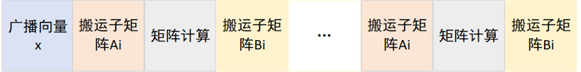
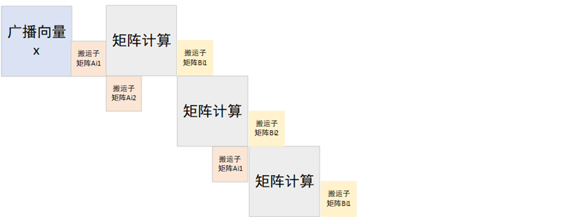
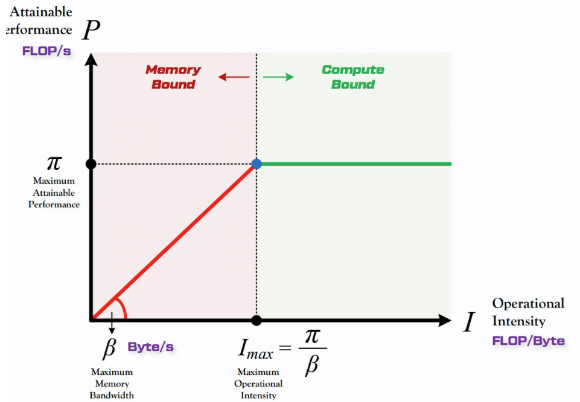
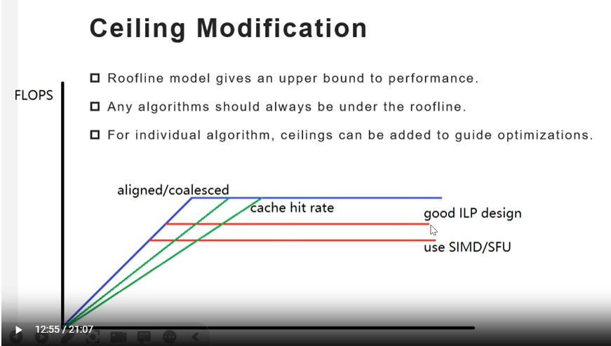

# 算子优化

1. 理论分析+microbenchmark获取各器件性能
2. 根据pipeline结合cost model和roofline model分析出程序的性能理论上限（程序优化的目标）和目前性能瓶颈（程序优化的方向）

### 对第一点的解释

各器件性能，主要是指

1. 带宽 = IO量/时间
2. 计算次数 = 计算量/时间

一般来说，性能参数会直接告诉你，但如果没用告诉你，你该怎么分析

如何从理论上进行计算，以simd器件进行性能分析，

sim_load一次可以装载64字节的数据，时钟频率是2.5GHz，假设指令流水能够充分排起来，每个cycle执行一次的话，那么带宽为

```math
\frac{64B}{\frac{1}{2.5GHz}} = 0.15TB/s
```

simd_add一次可以16个float相加，时钟频率是2.5GHz，假设指令流水能够充分排起来，每个cycle执行一次的话，那么算力为

```math
\frac{16}{\frac{1}{2.5GHz}} = 0.04TFLOPS
```

但有时候，硬件性能不知道而且无法从理论上去分析，那么就需要做microbenchmark即写代码去测试其执行时间，再根据传输量或计算量计算出硬件的带宽和算力

### 对第二点的解释

以矩阵向量乘gemv为例，一个简单的实现 $Ax=y$ 可以分为如下四个步骤，

1. 广播向量 $x$
2. 搬运矩阵 $A$ 的子矩阵 $A_i$
3. 矩阵计算 $A_ix=y_i$
4. 搬运向量 $y$ 的子矩阵 $y_i$

画出该实现的pipeline如下



### Cost Model——从整体上把握程序性能

根据pipeline将程序拆成多个部分，每个部分单独分析性能，理论时间 = 访存量 / 时间 = 计算量 / 算力，这样就能求出每个部分的时间，累加后就知道了程序的理论性能

上述gemv的理论性能为

```math
t = t_1 + n * (t_2 + t_3 + t_4)
```

其中，

1. $t_1$ 为广播向量 $x$ 的时间，计算 $ t_1 =  x的数据量 / 广播带宽 $
2. $t_2$ 为搬运矩阵 $A$ 的子矩阵 $A_i$ 的时间，计算 $ t_2 = A_i的数据量 / 带宽 $
3. $t_3$ 为矩阵计算的时间，计算 $ t_3 = 计算量 / 算力 $
4. $t_4$ 为搬运向量 $y$ 的子矩阵 $y_i$ 的时间，计算 $ t_4 = y_i的数据量 / 带宽 $
5. $n$ 为矩阵 $A$ 切分的块数

但这个方法是有问题的，搬运完才能算，算完才能搬运，相等于有很多时间器件根本没工作，这样就有相当于一部分就浪费掉了

如果是不同器件实现的操作且数据无依赖关系，那么可以进行相互掩盖，这样就可以节省掉某一部分的时间



这里利用双缓冲去掉了数据间依赖关系，矩阵计算和搬运A,B子矩阵的就可以互相掩盖，此时理论性能为

```math
t = t_1 + n * max(t_3, t_2 + t_4) + t_2 + t_4
```

这样性能就提升上来了，

1. 最好的情况 $t_3 = t_2 + t_4$ ，相当于所有器件从头到尾一直都在工作
2. $t_3 < t_2 + t_4$ ，有一部分时间矩阵计算器件没工作，有性能损失
3. $t_3 > t_2 + t_4$ ，有一部分时间数据搬运器件没工作，有性能损失

所以这个方法要求矩阵 $A$ 要进行合理切分

### Roofline Model——从具体上分析程序性能

分析程序在指定硬件上的性能上界的简单模型，即FLOPS = MIN(峰值带宽 × 计算密度，峰值性能)，即下图所示



其中，

| 指标 | 定义 |	单位 |
|:--------:| :---------:|:--------:|
| 计算量 | - | FLOPs |
| 访存量 | - | Bytes or KB/MB/GB |
| 计算密度 | 单位访存量下的计算量 | FLOPs/Byte |

修正后



有的操作会造成带宽降低，而有的操作会造成算力降低，引起的变化是不一样的，需要修正Roofline Model，根据修正模型反过来思考就能得到怎么提升性能的方法

确定现在位于图上哪一点

Memory Bound —— 时间 = IO量 / 带宽

1. 想办法减少数据量 （避免重复访存）
2. 想办法提升带宽
    1. 尽可能利用数据局部性（提高缓存命中率）
    2. 减少数据重复访问（广播）
    3. 以硬件友好的方式访问内存（对齐/合并）

Compute Bound —— 时间 = 计算量 / 算力
1. 想办法减少数据量 （避免重复计算）
2. 想办法提升算力
    1. 向量化（SIMD）
    2. 指令并行（循环展开）
    3. 计算单元始终处于忙碌状态（双缓冲/软流水）
    4. 利用特定的计算硬件（ACE）

### 关注指标

1. 时间
2. 带宽 = IO量/时间
3. 计算次数 = 计算量/时间

以gemm和conv为例，


对于 gemm 来说，
- A的维度为 $m×k$ ，B的维度为 $k×n$ ，C的维度为 $m×n$ ，那么它要传输的数据量即IO量就是 $(m×k)*sizeof(typeA)+(k×n)*sizeof(typeB)+(m×n)*sizeof(typeC)$
- A的维度为 $m×k$ ，B的维度为 $k×n$ ，C的维度为 $m×n$ ，C中每一个点需要k次乘法计算， $(k-1)$ 次加法计算，C中又有 $m×n$ 个点，所以计算量为 $(2k-1)×m×n$


对于conv来说，
- 输入数据的维度为 $N×H×W×C$ ，卷积核的维度为 $C×R×S×M$ ，输出数据的维度为 $N×E×F×M$ ，那么它要传输的数据量即IO量就是 $(N×H×W×C)*sizeof(input)+(C×R×S×M)*sizeof(conv)+(N×E×F×M)*sizeof(output)$
- 输入数据的维度为 $N×H×W×C$ ，卷积核的维度为 $C×R×S×M$ ，输出数据的维度为 $N×E×F×M$ ，输出数据中每一个点需要 $C×R×S$ 次乘法计算， $(C×R×S)$ 次加法计算（考虑偏置 b），输出数据中又有 $N×E×F×M$ 个点，所以它的计算量为 $(2×C×R×S)×N×E×F×M$

值得注意的是，
1. 有cache时的带宽：$ BW = p_{hit}BW_{cache} + (1 - p_{hit})BW_{mem} $
2. 广播时的带宽：$ BW = N * BW_{mem} $