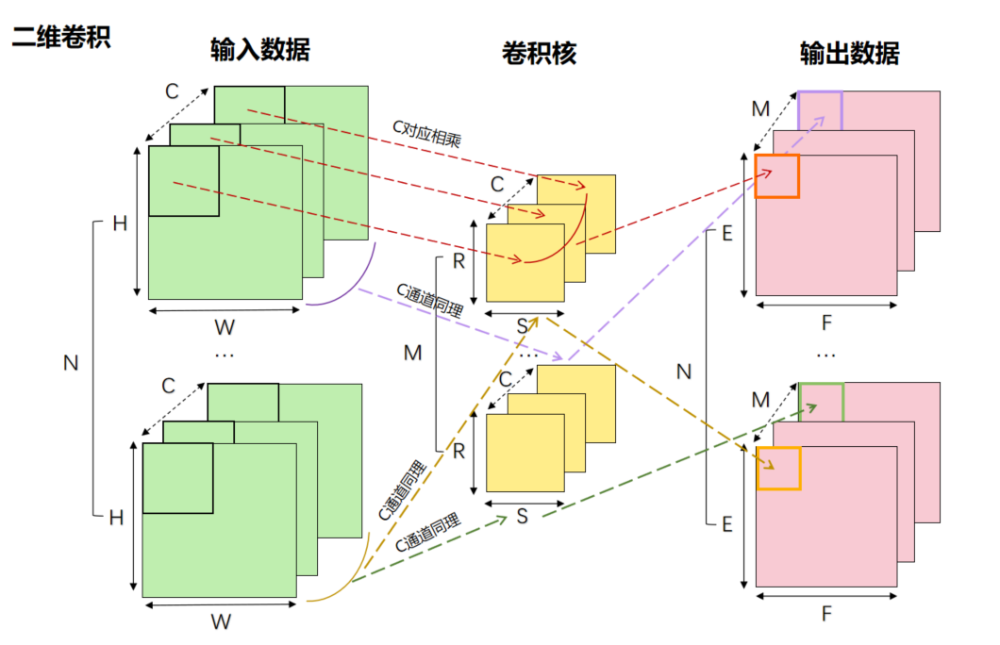

# 算子优化

1. 理论分析+microbenchmark获取各硬件性能
2. 根据pipeline结合cost model和roofline model分析出程序的性能理论上限（程序优化的目标）和目前性能瓶颈（程序优化的方向）

### 评估指标

1. 时间
2. 带宽 = IO量/时间
3. 计算次数 = 计算量/时间

以gemm和conv为例，

对于 gemm 来说，
- A的维度为 $m×k$ ，B的维度为 $k×n$ ，C的维度为 $m×n$ ，那么它要传输的数据量即IO量就是 $(m×k)*sizeof(typeA)+(k×n)*sizeof(typeB)+(m×n)*sizeof(typeC)$
- A的维度为 $m×k$ ，B的维度为 $k×n$ ，C的维度为 $m×n$ ，C中每一个点需要k次乘法计算， $(k-1)$ 次加法计算，C中又有 $m×n$ 个点，所以计算量为 $(2k-1)×m×n$

对于conv来说，
- 输入数据的维度为 $N×H×W×C$ ，卷积核的维度为 $C×R×S×M$ ，输出数据的维度为 $N×E×F×M$ ，那么它要传输的数据量即IO量就是 $(N×H×W×C)*sizeof(input)+(C×R×S×M)*sizeof(conv)+(N×E×F×M)*sizeof(output)$
- 输入数据的维度为 $N×H×W×C$ ，卷积核的维度为 $C×R×S×M$ ，输出数据的维度为 $N×E×F×M$ ，输出数据中每一个点需要 $C×R×S$ 次乘法计算， $(C×R×S)$ 次加法计算（考虑偏置 b），输出数据中又有 $N×E×F×M$ 个点，所以它的计算量为 $(2×C×R×S)×N×E×F×M$

值得注意的是，
1. 有cache时的带宽：$ BW = p_{hit}BW_{cache} + (1 - p_{hit})BW_{mem} $
2. 广播时的带宽：$ BW = N * BW_{mem} $

### Microbenchmark

有时候，硬件性能不知道而且无法从理论上去分析，那么就需要写代码测试时间，再根据传输量或计算量计算出硬件的带宽和算力

### Cost Model

将程序拆成多个部分，每个部分单独分析性能，最后进行整合

例如常见的gemv，一个简单的实现即可以分为广播向量x，搬运矩阵A的子矩阵，矩阵计算和搬运向量y的子矩阵四个过程，针对每个过程进行性能分析，根据带宽和算力就能算出每个过程的理想时间，即理论时间 = 访存量 / 带宽和理论时间 = 计算量 / 算力，这样就获得了整个程序的理论性能

如果是不同硬件实现的操作且数据无依赖关系，那么可以进行相互掩盖，这样就可以节省掉某一部分的时间

这里利用双缓冲去掉了数据间依赖关系，矩阵计算和搬运A,B子矩阵的就可以互相掩盖，假设矩阵计算时间<搬运A,B子矩阵时间之和，那么整个过程就只需要考虑广播向量x的时间+第一次搬运子矩阵Ai的时间+N次矩阵计算时间+最后一次搬运子矩阵Bi的时间

### Roofline Model：分析程序在指定硬件上的性能上界的简单模型

即FLOPS = MIN(峰值带宽 × 计算密度，峰值性能)，即下图所示

其中，

| 指标 | 定义 |	单位 |
|:--------:| :---------:|:--------:|
| 计算量 | - | FLOPs |
| 访存量 | - | Bytes or KB/MB/GB |
| 计算密度 | 单位访存量下的计算量 | FLOPs/Byte |

修正后

有的操作会造成带宽降低，而有的操作会造成算力降低，引起的变化是不一样的，需要修正Roofline Model，根据修正模型反过来思考就能得到怎么提升性能的方法

确定现在位于图上哪一点

Memory Bound
1. 尽可能利用数据局部性（提高缓存命中率）
2. 减少数据重复访问（广播）
3. 以硬件友好的方式访问内存（对齐/合并）

Compute Bound
1. 向量化（SIMD）
2. 指令并行（循环展开）
3. 计算单元始终处于忙碌状态（双缓冲/软流水）
4. 利用特定的计算硬件（ACE）

