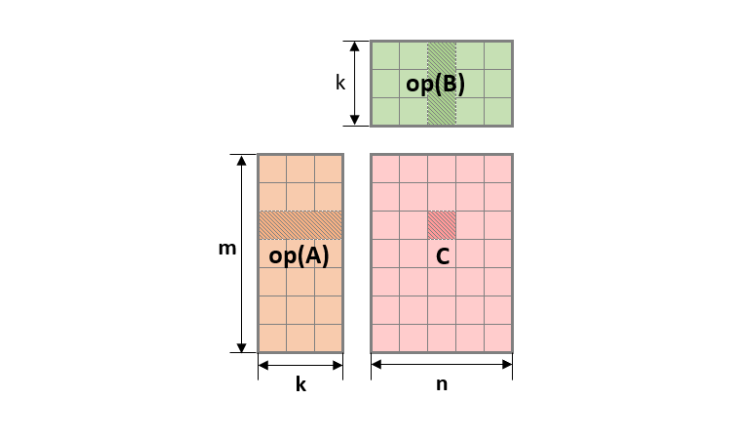
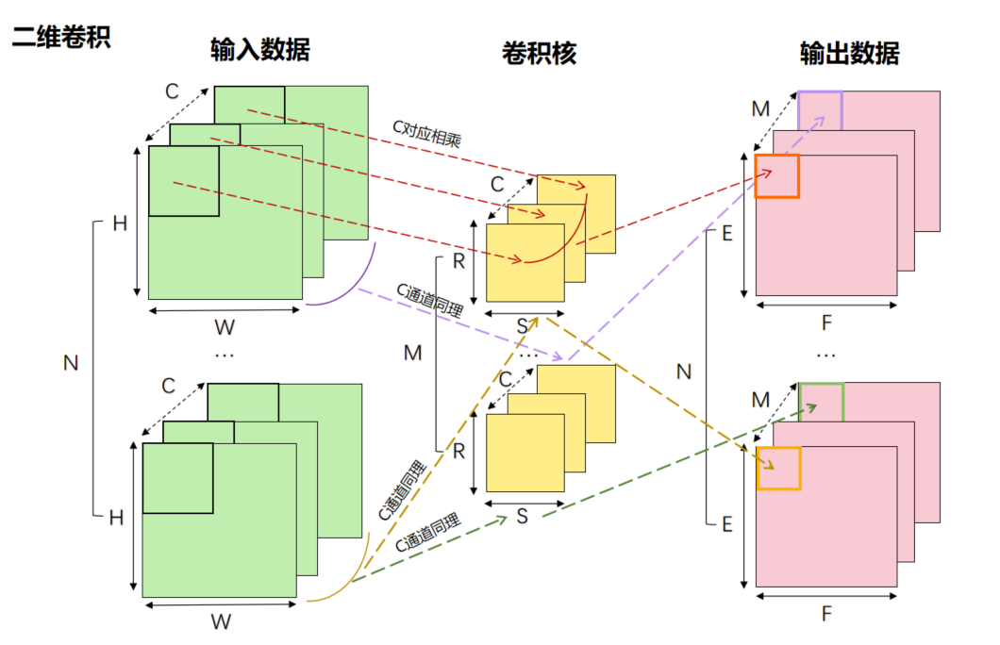

# cuYAN
This is my record of researching operator optimization.

### 关注指标
1. 时间
2. 带宽 = IO量/时间
3. 计算次数 = 计算量/时间

以gemm和conv为例，

对于 gemm 来说，
- A的维度为$m×k$，B的维度为$k×n$，C的维度为$m×n$，那么它要传输的数据量即IO量就是$(m×k)*sizeof(typeA)+(k×n)*sizeof(typeB)+(m×n)*sizeof(typeC)$
- A的维度为$m×k$，B的维度为$k×n$，C的维度为$m×n$，C中每一个点需要k次乘法计算，$(k-1)$次加法计算，C中又有$m×n$个点，所以计算量为$(2k-1)×m×n$
  

对于conv来说，
- 输入数据的维度为$N×H×W×C$，卷积核的维度为$C×R×S×M$，输出数据的维度为$N×E×F×M$，那么它要传输的数据量即IO量就是$(N×H×W×C)*sizeof(input)+(C×R×S×M)*sizeof(conv)+(N×E×F×M)*sizeof(output)$
- 输入数据的维度为$N×H×W×C$，卷积核的维度为$C×R×S×M$，输出数据的维度为$N×E×F×M$，输出数据中每一个点需要$C×R×S$次乘法计算，$(C×R×S-1)$次加法计算（不考虑偏置 b），输出数据中又有$N×E×F×M$个点，所以它的计算量为$(2×C×R×S-1)×N×E×F×M$

### TODO
1. BLAS
2. DNN
    1. conv_forward
        - [ ] 含义
        - [ ] 实现
            - [ ] 定义
            - [ ] Img2col+gemm
            - [ ] FFT method
            - [ ] Winograd Algorithm
        - [ ] 优化
    2. conv_bakcward_bias
    3. cov_backward_input
    4. conv_backward_filter
3. RAND